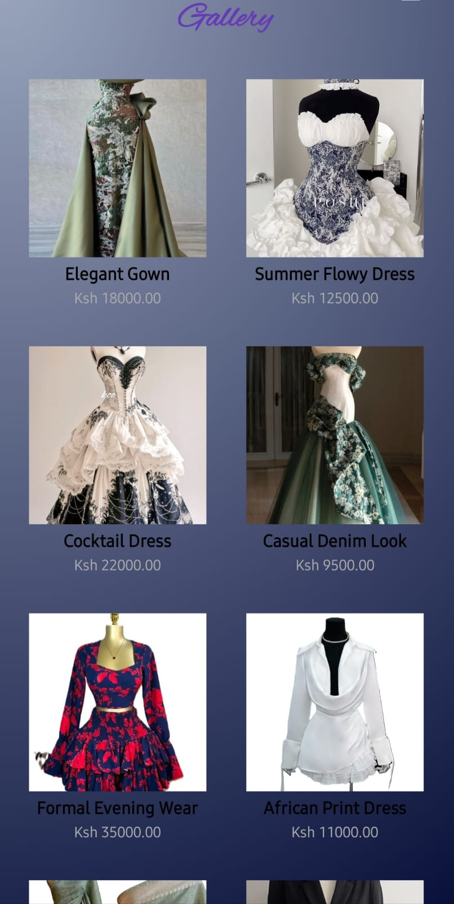
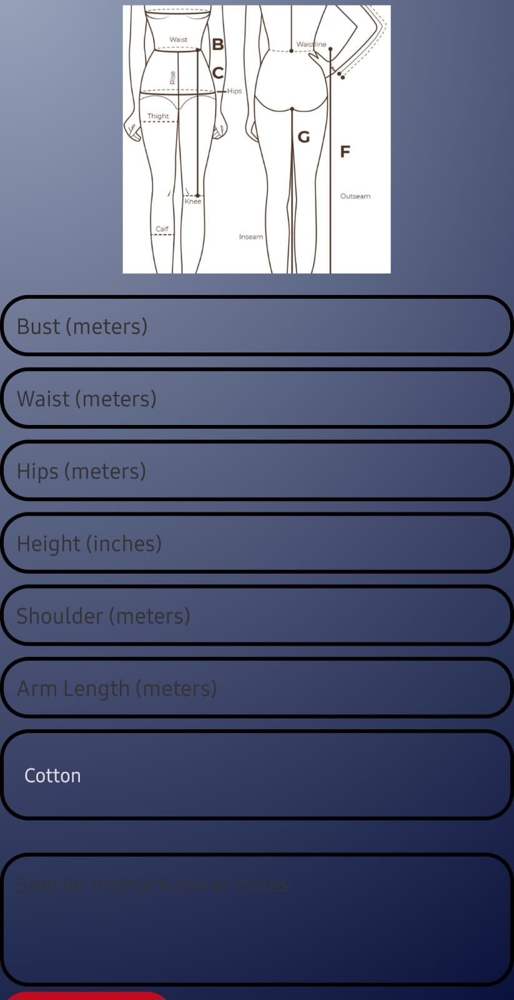

Dorah's Designs

Dorah's Designs is an Android mobile application developed to help improve tailoring business operations through technology. The application was inspired by challenges faced by local tailor Dorah, including customer management, measurement recording, design selection, and order organization.

The system aims to provide a more efficient and convenient way for customers and tailors to interact while helping small tailoring businesses grow and improve service delivery.

Features
User registration and login
Profile management
Gallery of clothing designs
Measurement recording and storage
Material selection
Order placement and management
Custom design options
Contact Dorah functionality
Technologies Used
Java
Android Studio
SQLite Database
XML
Git & GitHub

Purpose

This project was developed as an academic project and as a practical solution to support small tailoring businesses using mobile technology.

Future Improvements
Online payments
Appointment scheduling
Real-time notifications
Cloud database integration
Admin dashboard

Screenshots

 Home Page

 Gallery Page

 Measurements Page

Author

Anita Alice
